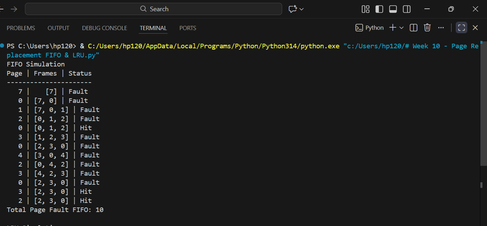
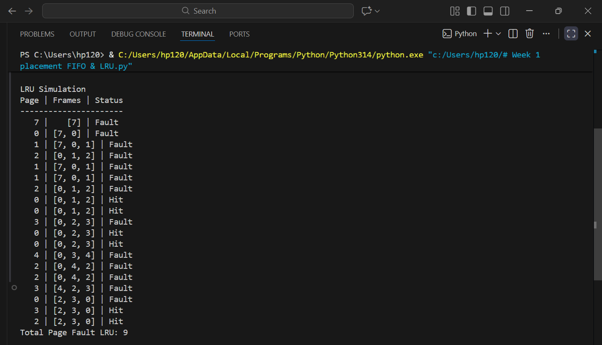

# Laporan Praktikum Minggu 10
Topik: Manajemen Memori – Page Replacement (FIFO & LRU)

---

## Identitas
- **Nama**  : Alfan Nur Fadzilah
- **NIM**   : 250320575
- **Kelas** : 1DSRA

---

## Tujuan
Setelah menyelesaikan tugas ini, mahasiswa mampu:
1. Mengimplementasikan algoritma page replacement FIFO dalam program.
2. Mengimplementasikan algoritma page replacement LRU dalam program.
3. Menjalankan simulasi page replacement dengan dataset tertentu.
4. Membandingkan performa FIFO dan LRU berdasarkan jumlah *page fault*.
5. Menyajikan hasil simulasi dalam laporan yang sistematis.

---

## Dasar Teori
Manajemen memori adalah bagian dari sistem operasi yang mengatur penggunaan memori utama secara efisien. Dalam sistem paging, memori dibagi menjadi page dan frame. Jika halaman yang dibutuhkan tidak ada di memori, terjadi page fault dan sistem menggunakan algoritma page replacement.

Algoritma FIFO menggantikan halaman yang pertama kali masuk ke memori, sedangkan LRU menggantikan halaman yang paling lama tidak digunakan. FIFO sederhana namun kurang efektif, sementara LRU lebih baik dalam mengurangi page fault tetapi lebih kompleks dalam implementasi.

---

## Langkah Praktikum
1. **Menyiapkan Dataset**

   Gunakan *reference string* berikut sebagai contoh:
   ```
   7, 0, 1, 2, 0, 3, 0, 4, 2, 3, 0, 3, 2
   ```
   Jumlah frame memori: **3 frame**.

2. **Implementasi FIFO**

   - Simulasikan penggantian halaman menggunakan algoritma FIFO.
   - Catat setiap *page hit* dan *page fault*.
   - Hitung total *page fault*.

3. **Implementasi LRU**

   - Simulasikan penggantian halaman menggunakan algoritma LRU.
   - Catat setiap *page hit* dan *page fault*.
   - Hitung total *page fault*.

4. **Eksekusi & Validasi**

   - Jalankan program untuk FIFO dan LRU.
   - Pastikan hasil simulasi logis dan konsisten.
   - Simpan screenshot hasil eksekusi.

5. **Analisis Perbandingan**

   Buat tabel perbandingan seperti berikut:

   | Algoritma | Jumlah Page Fault | Keterangan |
   |:--|:--:|:--|
   | FIFO | ... | ... |
   | LRU | ... | ... |


   - Jelaskan mengapa jumlah *page fault* bisa berbeda.
   - Analisis algoritma mana yang lebih efisien dan alasannya.

6. **Commit & Push**

   ```bash
   git add .
   git commit -m "Minggu 10 - Page Replacement FIFO & LRU"
   git push origin main
   ```

---

## Hasil Eksekusi

**FIFO**


**LRU**


---

## Analisis

### Tabel Perbandingan Algoritma Page Replacement

| Algoritma | Jumlah Page Fault | Keterangan |
|----------|------------------|------------|
| FIFO | 10 | Mengganti halaman yang pertama kali masuk ke memori tanpa melihat pola penggunaan |
| LRU | 9 | Mengganti halaman yang paling lama tidak digunakan berdasarkan riwayat akses |

### Perbedaan Jumlah Page Fault
Perbedaan jumlah page fault antara algoritma FIFO dan LRU terjadi karena perbedaan cara pemilihan halaman yang akan diganti. 
FIFO hanya mempertimbangkan urutan kedatangan halaman, sehingga halaman yang masih sering digunakan bisa tergantikan.
LRU mempertimbangkan frekuensi dan waktu terakhir akses halaman, sehingga halaman yang sering digunakan tetap berada di memori.

### Analisis Efisiensi Algoritma
Berdasarkan hasil simulasi, algoritma LRU lebih efisien dibandingkan FIFO karena menghasilkan jumlah page fault yang lebih sedikit.
Hal ini menunjukkan bahwa LRU lebih optimal dalam memanfaatkan frame memori, meskipun implementasinya lebih kompleks dibandingkan FIFO.
 

---

## Kesimpulan
Berdasarkan hasil simulasi algoritma page replacement FIFO dan LRU dengan jumlah frame memori sebanyak 3, dapat disimpulkan bahwa kedua algoritma memiliki cara kerja yang berbeda dalam mengganti halaman di memori. Algoritma FIFO mengganti halaman berdasarkan urutan kedatangan, sedangkan LRU mengganti halaman yang paling lama tidak digunakan.

Hasil simulasi menunjukkan bahwa algoritma LRU menghasilkan jumlah page fault yang lebih sedikit dibandingkan FIFO. Hal ini menandakan bahwa LRU lebih efisien dalam mengelola penggunaan memori karena mempertimbangkan pola akses halaman.

Meskipun FIFO lebih mudah diimplementasikan, LRU memberikan kinerja yang lebih baik. Oleh karena itu, algoritma LRU lebih direkomendasikan untuk sistem yang membutuhkan efisiensi penggunaan memori yang tinggi.

---

## Quiz
1. Apa perbedaan utama FIFO dan LRU?

   **Jawaban:**  Perbedaan utama FIFO dan LRU terletak pada cara menentukan halaman yang diganti:

FIFO (First In First Out) mengganti halaman yang paling pertama masuk ke memori, tanpa memperhatikan apakah halaman tersebut masih sering digunakan atau tidak.

LRU (Least Recently Used) mengganti halaman yang paling lama tidak digunakan, dengan mempertimbangkan riwayat akses halaman.

2. Mengapa FIFO dapat menghasilkan *Belady’s Anomaly*?
   
   **Jawaban:** FIFO dapat menghasilkan Belady’s Anomaly karena algoritma ini hanya mempertimbangkan urutan masuk halaman, bukan pola penggunaannya.

Ketika jumlah frame ditambah, FIFO tetap akan mengganti halaman yang paling awal masuk meskipun halaman tersebut sebenarnya masih sering digunakan. Akibatnya, penambahan frame justru dapat menyebabkan jumlah page fault meningkat, inilah yang disebut Belady’s Anomaly.
   
3. Mengapa LRU umumnya menghasilkan performa lebih baik dibanding FIFO?
   
   **Jawaban:**  LRU umumnya menghasilkan performa lebih baik dibanding FIFO karena mempertimbangkan riwayat penggunaan halaman.
LRU mengganti halaman yang paling lama tidak digunakan, sehingga halaman yang sering atau baru saja diakses tetap berada di memori.

Akibatnya, jumlah page fault lebih sedikit dan kinerja sistem menjadi lebih baik dibanding FIFO, yang hanya mengganti halaman berdasarkan urutan masuk tanpa melihat pola akses.

---

## Refleksi Diri
Tuliskan secara singkat:
- Apa bagian yang paling menantang minggu ini?  semua bagian menantang
- Bagaimana cara Anda mengatasinya?  bertanya kepada AI

---

**Credit:**  
_Template laporan praktikum Sistem Operasi (SO-202501) – Universitas Putra Bangsa_
